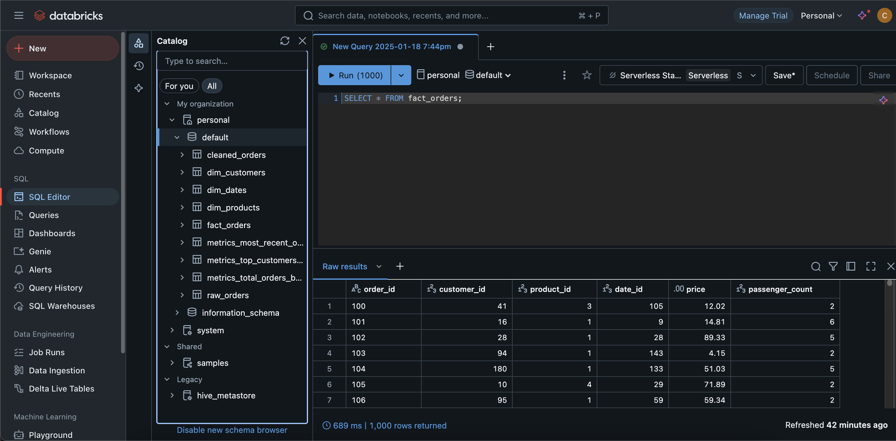

# sql-task

Here are my solutions for each part of the task.

## Part 1

Each day a large file is loaded to our SQL database containing all customer orders, the items in that order, and customer name.

This is becoming difficult to manage, so please devise a process to normalize the data coming in, such as by using a star schema.

This can be done however you feel is appropriate, use any libraries you feel are needed, and submit the code and the final application.db file.

**Assumptions:**

- `order_id` is a unique primary key

**Solution:**

I used SQLite to create a star schema with the following tables:

- `cleaned_orders`
- `dim_customers`
- `dim_dates`
- `dim_products`
- `fact_orders`

I transformed the data using SQLite and SQL queries, here: `src/sqlite_sql/transform`

I ran the following Python script to transform the data: `src/sqlite_transform.py`

Tests for the Python script are here: `test/test_transform.py`

The tables can be seen in the `application.db` SQLite database (using a tool like DBeaver).

## Part 2

Now the data has been transformed to make it easier to store, some of the reports need to be updated. Please provide SQL queries that can provide:

1. The total number of orders for each customer
2. The most recent order for each customer
3. For the past week, which customers have provided us with the most value

**Assumptions:**

- Today is 2023-12-10

**Solution:**

I created SQL queries that run on the transformed data, here: `src/sqlite_sql/analysis`

They created the following reports:

1. The total number of orders for each customer: `metrics_total_orders_per_customer`
2. The most recent order for each customer: `metrics_most_recent_order_per_customer`
3. For the past week, which customers have provided us with the most value: `metrics_top_customers_last_week`

I ran the following Python script to run the queries: `src/sqlite_analysis.py`

Tests for the Python script are here: `test/test_analysis.py`

The tables can be seen in the `application.db` SQLite database.

## Part 3

We currently manually upload this file from our supplier into S3 and run a copy command to get this table into Redshift. But, they have a REST API we can get the same data from. How could this process be automated/improved using cloud services?

**Solution:**

1. Use AWS Lambda + scheduler (or a similar service, you could use a cron job) to trigger the API call, transform the raw data, and store the data in S3, as parquet files.
2. Use the COPY command to load clean data into Redshift, also on a schedule/triggered when data is dumped in S3, perhaps even in the same Lambda function.

## Bonus

I added a bonus part to the task, where I created an ETL pipeline and dashboard using Databricks SQL dashboards to visualize the 3 metrics (in Part 2).

**Dashboard URL:**

https://dbc-3cc4a9ef-893f.cloud.databricks.com/dashboardsv3/01efd5dd706a1afaaf3e4cbe793a8d87/published?o=3932513282867114

**Screenshot of the dashboard:**

I used this Python script to create dummy data, here: `src/generate_fake_data.py`

I used this Databricks notebook to load the data from S3 into Databricks: `src/databricks_notebook.ipynb`

I ran Databricks SQL queries to transform the data, here: `src/databricks_sql/transform`

I ran the following Python script to run the queries: `src/databricks_transform.py`

I ran Databricks SQL queries to create the reports, here: `src/databricks_sql/analysis`

I ran the following Python script to run the queries: `src/databricks_analysis.py`

Tables can be seen in the SQL Warehouse in Databricks.

